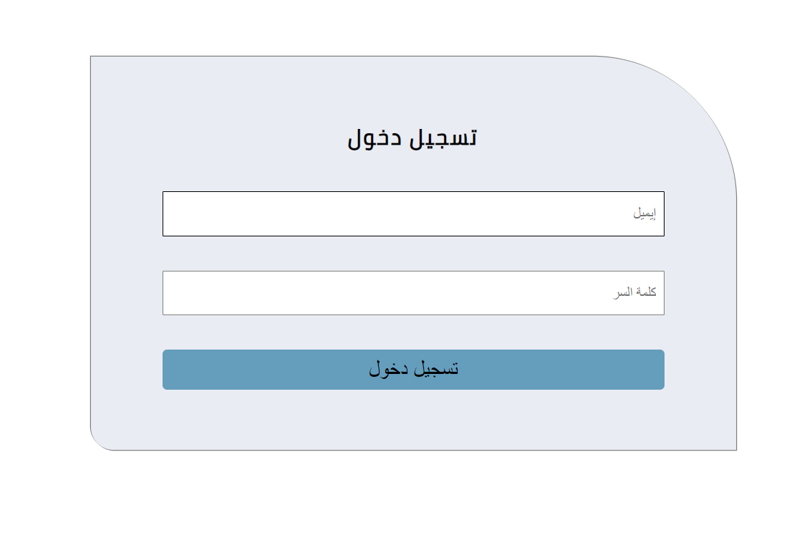
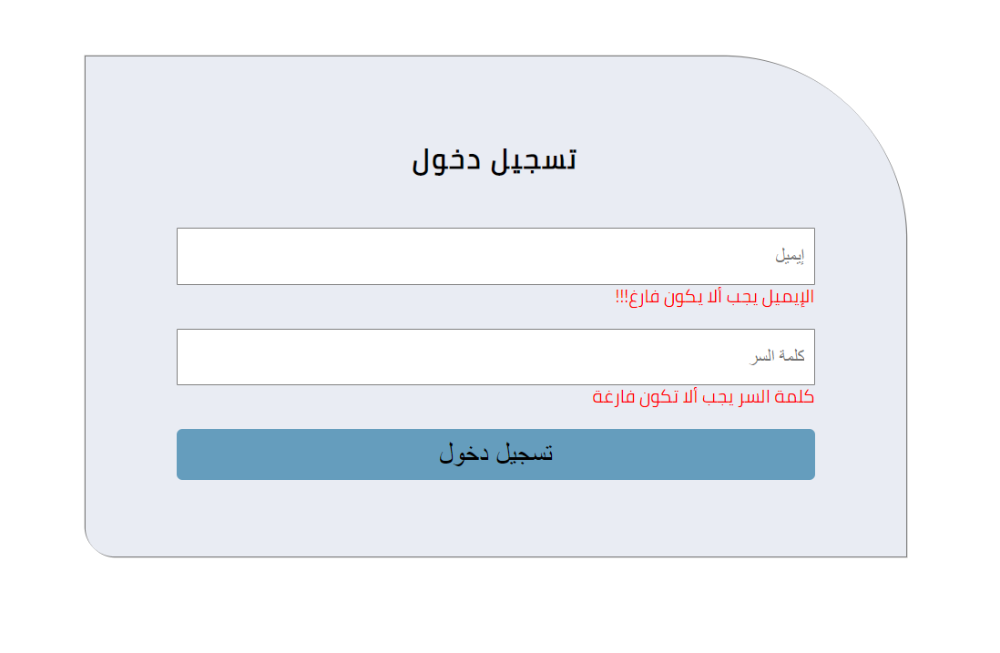
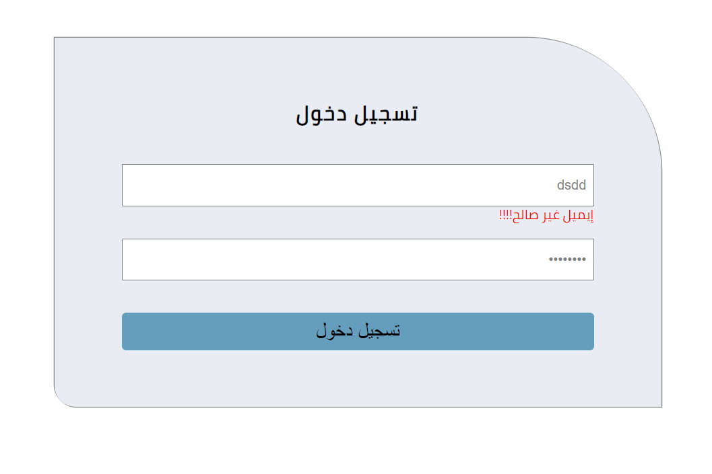

# Full Stack JavaScript Homework
<body dir="rtl">
    <h2 dir="rtl">المطلوب عمل فورم تسجيل دخول باستخدام html و css و JavaScript</h2>
     
    

     
    <ul dir="rtl">
        <li><h3 dir="rtl">يجب أن يتم فحص الإيميل و الباسوور قبل الارسال</h3></li>
        <li><h3 dir="rtl">إذا كان الإيميل فارغ أو غير مناسب يجب عرض رسالة خطأ أسفل عنصر الإيميل، كما هو موضح في الصورة</h3></li>
        <li><h3 dir="rtl">إذا كانت كلمة السر فارغة يجب عرض رسالة خطأ أسفل عنصر كلمة السر، كما هو موضح في الصورة</h3></li>
    </ul>
     
    

     
    

     
    <ul dir="rtl">
        <li><h3 dir="rtl">ستحتاج لاستخدام Regex عند فحص الإيميل</h3></li>
        <li><h3 dir="rtl">استخدم هذا الكود </h3>
        <code>const reg = /^(([^<>()\[\]\\.,;:\s@"]+(\.[^<>()\[\]\\.,;:\s@"]+)*)|(".+"))@((\[[0-9]{1,3}\.[0-9]{1,3}\.[0-9]{1,3}\.[0-9]{1,3}\])|(([a-zA-Z\-0-9]+\.)+[a-zA-Z]{2,}))$/</code></li>
    </ul>
    <h3 dir="rtl">لمزيد من المعلومات عن regex تصفح الرابط التالي:
     <a href="https://www.w3schools.com/jsref/jsref_obj_regexp.asp">JavaScript RegExp Reference</a></h3>
      
     

     <h3 dir="rtl">أتمنى لكم رحلة تعليمية ممتعة</h3>

</body>